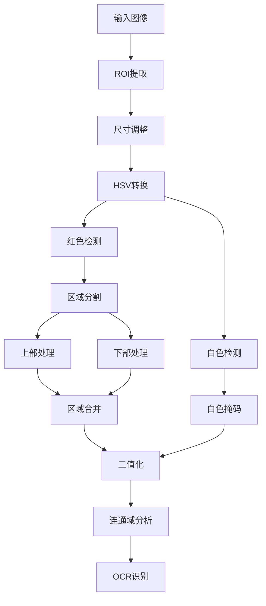

# Power OCR Video Analyzer

一个基于OpenCV和Tesseract的视频功率数字识别和分析工具，支持实时OCR识别、数据分析和能量消耗计算。特别适用于从视频中识别和记录功率显示屏上的数值变化。


## 目录

- [功能特点](#功能特点)
- [安装要求](#安装要求)
- [使用方法](#使用方法)
- [图像处理功能](#图像处理功能)
- [核心功能实现](#核心功能实现)
- [参数配置](#参数配置)
- [界面说明](#界面说明)
- [数据处理](#数据处理)
- [常见问题](#常见问题)
- [贡献指南](#贡献指南)
- [许可证](#许可证)

## 功能特点

### 视频处理

- 支持多种视频格式（AVI、MP4、MKV、MOV）
- ROI（感兴趣区域）实时选择和调整
- 完整的视频控制功能
  - 播放/暂停切换
  - 帧级快进/快退（±100帧）
  - 视频进度条导航
  - 跳转至开始/结束
- 显示当前帧号和总帧数

### OCR识别

- 支持白色和红色数字识别
- 智能颜色分析和区域分割
- 自适应阈值处理
  - 上下区域独立处理
  - 亮度和饱和度补偿
- 实时显示识别状态和结果
- 连通区域分析和过滤

### 数据分析

- 实时功率监测和显示
- 累计能量消耗计算（Wh）
- 识别准确率统计
- 数据可视化
  - 功率-时间曲线
  - 能量累积曲线
  - 识别状态标记
- CSV格式数据导出

### 参数系统

- HSV颜色空间参数控制
  - 红色区域参数（双区间）
  - 白色区域参数
- 区域分割参数调节
- 图像缩放因子控制
- 参数配置的保存/加载

## 安装要求

### 基础环境

- Python 3.6+
- Tesseract OCR 引擎 4.0+
- tkinter (Python标准库)

### Python依赖包

```bash
pip install opencv-python>=4.5.0
pip install numpy>=1.19.0
pip install pytesseract>=0.3.8
pip install matplotlib>=3.3.0
pip install pillow>=8.0.0
```

### Tesseract安装

- Windows:

  ```bash
  # 从GitHub下载安装器
  https://github.com/UB-Mannheim/tesseract/wiki
  # 设置环境变量
  TESSDATA_PREFIX=C:\Program Files\Tesseract-OCR\tessdata
  ```

- Linux:

  ```bash
  sudo apt update
  sudo apt install tesseract-ocr
  sudo apt install libtesseract-dev
  ```

- macOS:

  ```bash
  brew install tesseract
  ```

## 图像处理功能

### 处理流程



### 颜色检测

#### 红色检测（双区间）

```python
# 第一个红色区间
red_mask1 = cv2.inRange(hsv,
    np.array([0, red_sat_low, red_val_low]),
    np.array([10, red_sat_high, red_val_high]))

# 第二个红色区间
red_mask2 = cv2.inRange(hsv,
    np.array([160, red_sat_low, red_val_low]),
    np.array([179, red_sat_high, red_val_high]))

red_mask = cv2.bitwise_or(red_mask1, red_mask2)
```

#### 白色检测

```python
white_mask = cv2.inRange(hsv,
    np.array([0, 0, white_val_low]),
    np.array([180, white_sat_high, 255]))
```

### 区域分割处理

```python
height = hsv.shape[0]
split_y = int(height * split_ratio)

# 上部区域处理
upper_region = hsv[:split_y, :]
upper_val_low = red_val_low + upper_red_val_offset

# 下部区域处理
lower_region = hsv[split_y:, :]
lower_sat_low = red_sat_low + lower_red_sat_offset
```

## 参数配置

### HSV参数


| 参数名 | 说明 | 默认值 | 范围 |
|-------|------|--------|------|
| Red Hue Low1 | 红色色调下限1 | 0 | 0-179 |
| Red Hue High1 | 红色色调上限1 | 10 | 0-179 |
| Red Hue Low2 | 红色色调下限2 | 160 | 0-179 |
| Red Hue High2 | 红色色调上限2 | 179 | 0-179 |
| Red Saturation Low | 红色饱和度下限 | 100 | 0-255 |
| Red Saturation High | 红色饱和度上限 | 255 | 0-255 |
| Red Value Low | 红色亮度下限 | 100 | 0-255 |
| Red Value High | 红色亮度上限 | 255 | 0-255 |
| White Saturation High | 白色饱和度上限 | 83 | 0-255 |
| White Value Low | 白色亮度下限 | 151 | 0-255 |


### 区域分割参数
| 参数名 | 说明 | 默认值 | 范围 |
|-------|------|--------|------|
| Split Ratio | 分割位置比例 | 0.4 | 0.1-0.9 |
| Upper Value Offset | 上部亮度偏移 | -20 | -100-100 |
| Lower Saturation Offset | 下部饱和度偏移 | 25 | -100-100 |
| Scale Factor | 图像缩放因子 | 3.0 | 1.0-5.0 |

## 参数调优建议

### 颜色检测参数


#### 红色检测
- **色调范围1**: 0-10
  - 适用于纯红色区域
  - 需要考虑光照影响
  
- **色调范围2**: 160-179
  - 适用于深红色区域

- **饱和度范围**: 100-255
  - 较高的下限避免干扰

- **亮度范围**: 100-255
  - 下限根据环境光调整
  - 上限通常保持最大


#### 白色检测
- **饱和度上限**: 83
  - 较低以排除彩色区域

- **亮度下限**: 151
  - 较高以确保足够的亮度
  - 避免灰色干扰

### 区域分割参数

- **分割比例** (0.4)
  - 根据数字在ROI中的位置调整

- **上部偏移** (-20)
  - 负值补偿较暗的上部区域

- **下部偏移** (25)
  - 正值增强较弱的下部区域
  - 范围建议：15到35

## 数据处理


### OCR配置
```python
custom_config = (
    '--oem 3 --psm 7 '
    '-c tessedit_char_whitelist=0123456789.W '
    '--user-patterns \\d+\\.\\d+W '
    '--user-patterns \\d+W '
)
```


### 数据验证和插值策略
- 物理范围验证: 0-150W
- 连续性检查: 相邻值差异不超过20W
- 插值方法:
  - 短期异常(≤3帧): 保持上一个有效值
  - 长期异常: 使用局部平均值


### 能量计算
```python
time_delta = (current_time - last_time) / 3600  # 转换为小时
instant_energy = power * time_delta  # 瞬时能量
total_energy += instant_energy  # 累计能量
```

## 性能优化


### 处理速度优化
- 最小化ROI区域
- 优化缩放因子
- 减少不必要的复制
- 使用numpy向量化操作


### 内存使用优化
- 及时释放临时变量
- 限制历史数据量
- 定期清理缓存
- 使用适当的数据类型

## 常见问题


### 识别问题
1. Q:   红色数字识别率低
   A: 
   - 调整HSV参数范围
   - 优化区域分割比例
   - 适当增加缩放因子

2. Q: 数字跳变频  繁
   A: 
   - 检查ROI区域是否精确
   - 调整验证参数阈值
   - 增加平滑处理窗口


### 性能问题
1.   Q: 处理速度慢
   A: 
   - 减小ROI区域
   - 降低缩放因子
   - 优化帧处理间隔

2. Q: 内存占用  高
   A: 
   - 及时清理历史数据
   - 限制数据保存长度
   - 使用数据压缩存储

## 贡献指南

1. Fork项目
2. 创建特性分支
3. 提交改动
4. 发起Pull Request


欢迎提交以下内容：
- Bug修复
- 新功能建议
- 文档改进
- 使用案例

## 许可证

本项目采用[MIT License](LICENSE)许可证。

## 更新日志


### v1.0.0 (2024-11-06)
- 初始版本发布
- 实现基础OCR识别功能
- 支持视频处理和控制
- 添加数据分析和可视化
- 完善参数调节系统

## 联系方式

如有问题或建议，请通过以下方式联系
：
- 提交Issue
- Pull Request
- 项目讨论区

感谢使用本工具！
